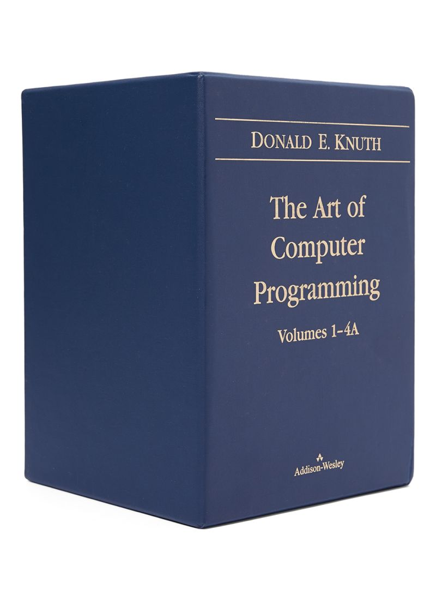
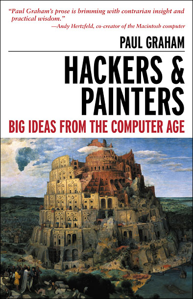
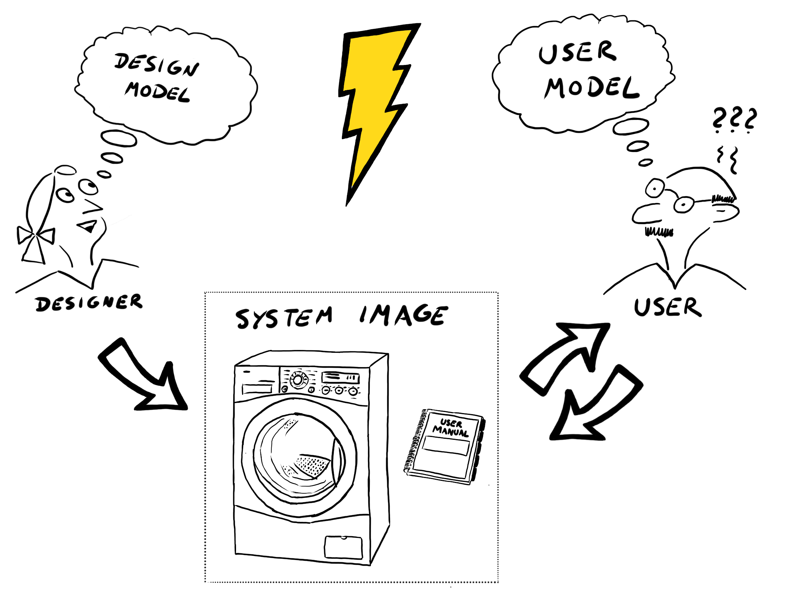
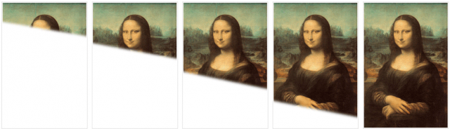
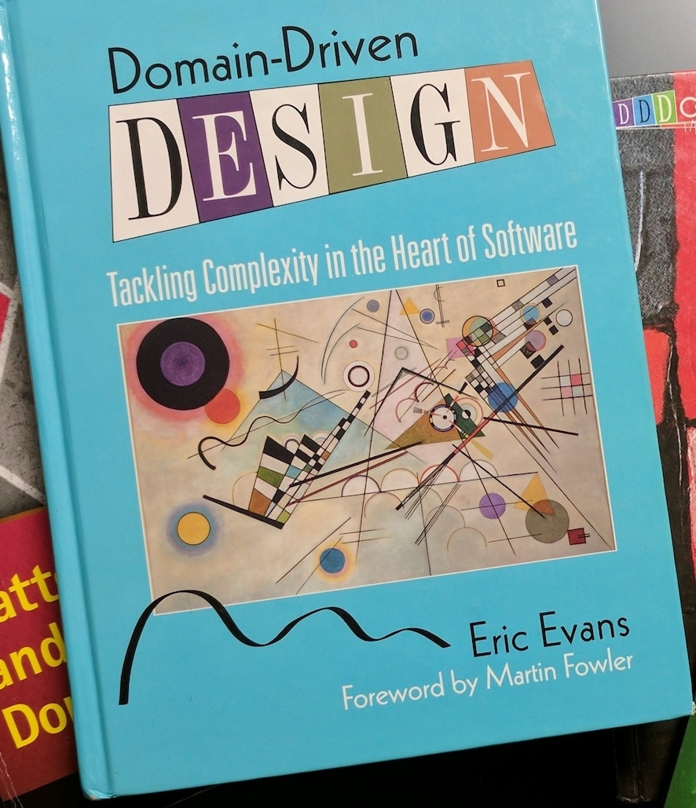
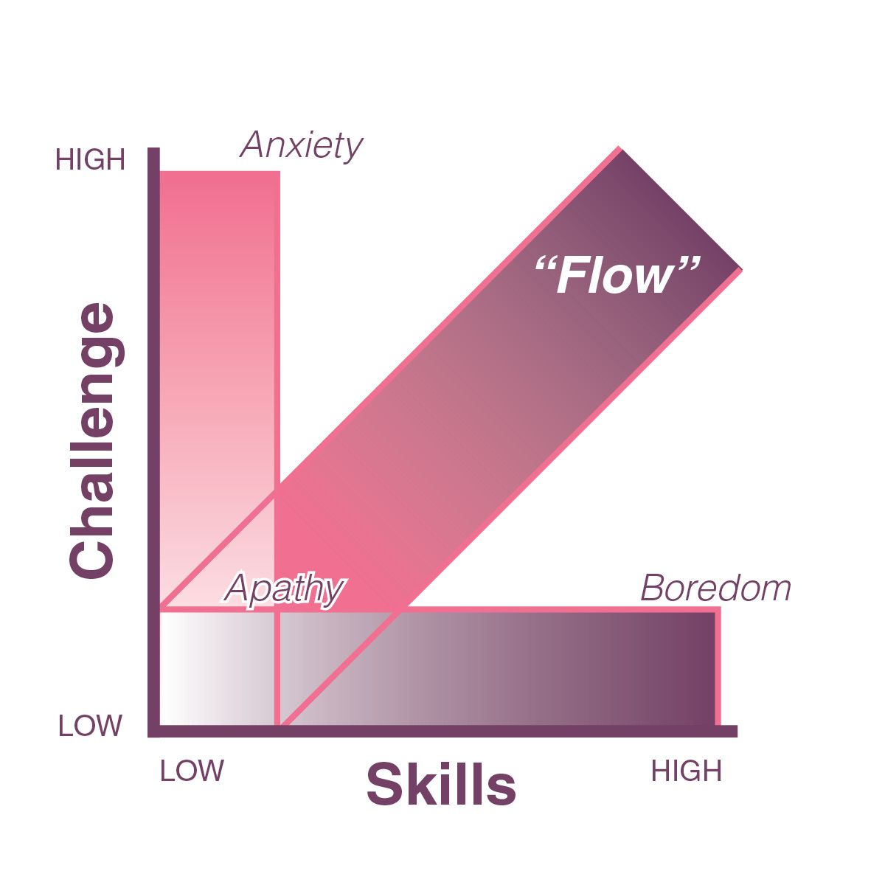
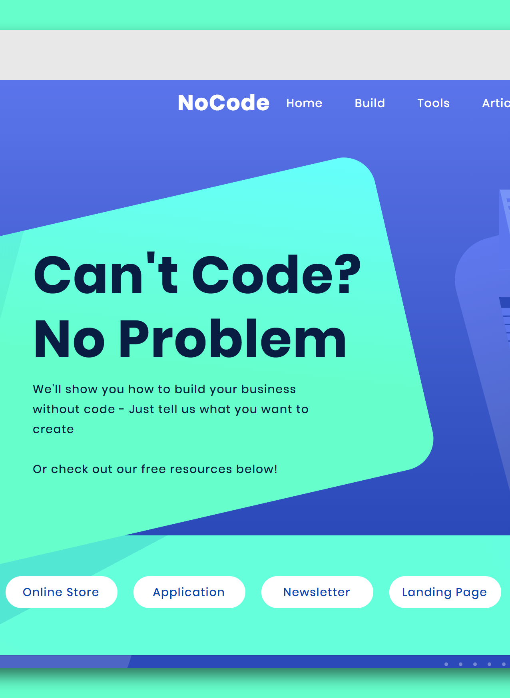
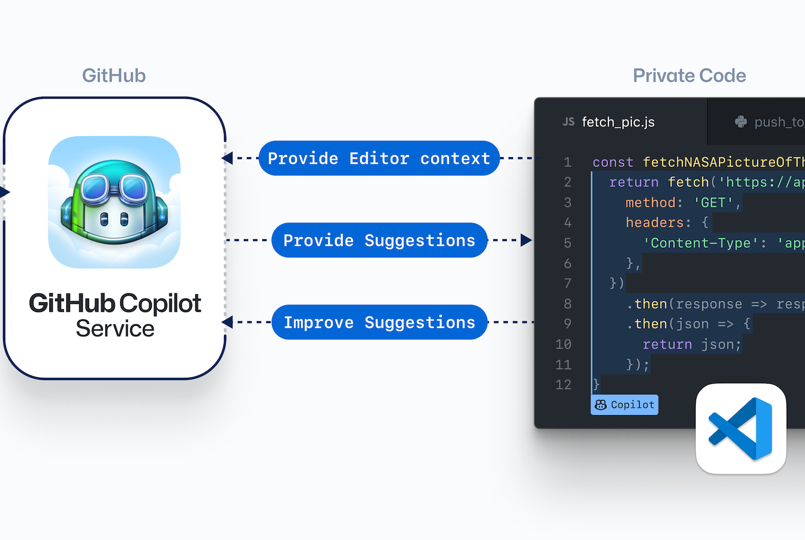
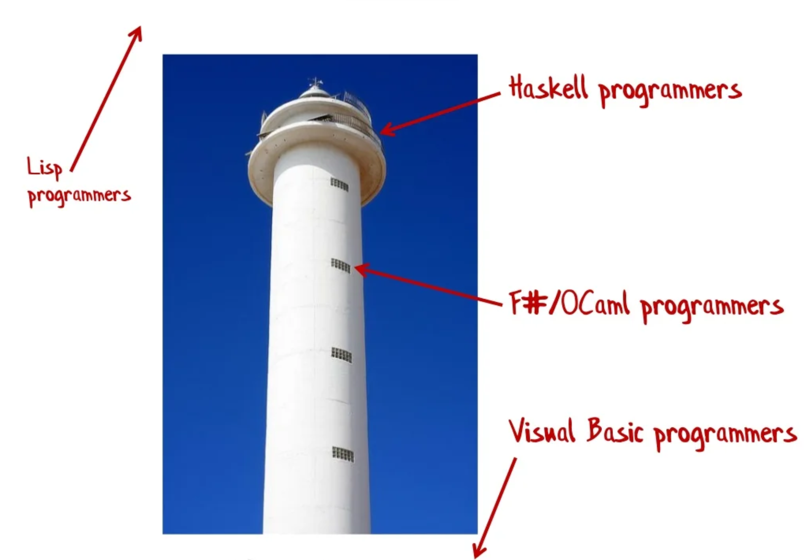

<!-- _class: title -->

# Developers are (Conceptual) Designers

Mathieu François - March 2022
https://digitalstoic.io/

---

<!-- _class: title -->

# _Is programming science or art?_

--- 

# This is the most mythical programming book ever

## Written by a computer [_scientist_](https://en.wikipedia.org/wiki/Donald_Knuth)

(acknowledged by [Bill Gates](https://www.quora.com/Why-did-Bill-Gates-say-If-you-think-you-re-a-really-good-programmer-read-Art-of-Computer-Programming-You-should-definitely-send-me-a-r%C3%A9sum%C3%A9-if-you-can-read-the-whole-thing) himself)

<!-- Notes:  “If you think you’re a really good programmer… read Art of Computer Programming… You should definitely send me a résumé if you can read the whole thing” -->

---

# The founder of Y combinator shares a [similar vision](http://www.paulgraham.com/hackpaint.html)

---

<!-- _class: title -->

# _Why do experts emphasize creativity in programming?_

--- 

# It's all about mental models

Good developers:
- Turn into reality conceptual models, in a clear and safe manner that meets the users' expectations and world view
- Are good at mental models of mental models

---

# This is _real_ design
 
Principles from the best design book ever:
- Visibility, affordance, system image, , mental models, (natural) mapping, feedback

Sir Fred Brooks: [The Design of Design](https://en.wikipedia.org/wiki/The_Design_of_Design) (nothing new since the IBM 360 in the 60s)

---

# Waterfall development

Needed by space engineering

# 
# Corporate Agile

Iterative only is not enough

# 
# _Real_ Agile = Sketching

Refine over time the conceptual model

<!-- TODO: https://www.jonahgroup.com/blog/agile-development-and-the-mona-lisa -->

---

# Many methodologies around the corner

Design Thinking, [Domain-Driven Design](https://github.com/ddd-crew/ddd-starter-modelling-process), [Design Sprints](https://www.gv.com/sprint/), etc... 

But we're far from satisfactory practices. As an industry, software is still [_immature_](https://en.wikipedia.org/wiki/The_Mythical_Man-Month)

---

# The dangers of bad design

It's not a process failure, it's a [design failure](https://www.core77.com/posts/105540/Screenshot-of-the-Horrific-UI-Design-That-Led-Citigroup-to-Accidentally-Send-893-Million):
- As a Maker, _what am I supposed to do?_
- As a Checker, _am I sure how the system work? Will there be side effects?_

--- 

<!-- _class: title -->

# _So what should we do?_

---

# Foster good design

It's not about fancy office and post-its. What matters:
- Build [shared understanding](https://www.jpattonassociates.com/story-mapping/)
- Protect the [flow of developers](http://www.paulgraham.com/makersschedule.html)
- Enable safe experiments[
... and good [Agile philosophy](https://agilemanifesto.org/principles.html)

---

<!-- _class: title -->

# The future of programming: better design 

---

# Low Code is for those who are <a href=" https://architectelevator.com/architecture/low-code-no-code/">afraid of code</a>

Nothing new: "Everything besides assembly language is low-code"

Well managed clear code is an asset, not a liability 

---

# AI as developers?

[GitHub Copilot](https://copilot.github.com/) is an impressive start but it mostly generates boilerplate

AI generating conceptual models of "real world" will be close to general intelligence

---

#  Higher and higher level languages

Promising (but not new) techniques, especially from FP:

ADT ([Algebraic Data Type](https://fsharpforfunandprofit.com/posts/type-size-and-design/)), DSL ([Domain Specific Language](https://www.pirrmann.net/fun-with-turtles/)), [Literate programming](https://en.wikipedia.org/wiki/Literate_programming) (Knuth again), declarative languages, etc

---

<!-- _class: title -->

# Let's spread ❤️ and good (conceptual) design 

---

