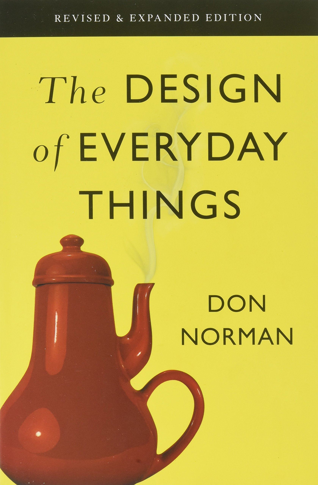

<!-- _class: title -->

# Developers are (Conceptual) Designers

Mathieu François - March 2022
https://digitalstoic.io/

---

<!-- _class: title -->

# _Is Programming Science or Art?_

--- 

# This is the most mythical programming book ever

## Written by a Computer [_Scientist_](https://en.wikipedia.org/wiki/Donald_Knuth)

(acknowledged by [Bill Gates](https://www.quora.com/Why-did-Bill-Gates-say-If-you-think-you-re-a-really-good-programmer-read-Art-of-Computer-Programming-You-should-definitely-send-me-a-r%C3%A9sum%C3%A9-if-you-can-read-the-whole-thing) himself)

<!-- Notes:  “If you think you’re a really good programmer… read Art of Computer Programming… You should definitely send me a résumé if you can read the whole thing” -->

---

# The founder of Y combinator shares a [similar vision](http://www.paulgraham.com/hackpaint.html)

---

<!-- _class: title -->

# _Why Do Experts Emphasize the Creativity in Programming?_

--- 

# It's all about mental models

Good developers turn into reality conceptual models, in a clear and safe manner that meets the users' expectations and world view

---

# This is _real_ Design
 
Principles from the only book to read:
- Visibility
- Affordance
- System Image
- Mental Models
- (Natural) mapping
- Feedback

---

# Waterfall development

OK for rocket engineering though

# 
# Corporate Agile

Iterative only is not enough

# 
# _Real_ Agile = Sketching

Refine over time the conceptual model

<!-- TODO: https://www.jonahgroup.com/blog/agile-development-and-the-mona-lisa -->

---

# Many methodologies and frameworks

Design Thinking, Domain-Driven Design, Design Sprints, etc... 

But we're far from satisfactory practices. As an industry, software is still _immature_

---

# The dangers of bad design

It's not a process failure, it's a design failure:
- As a Maker, _what am I supposed to do?_
- As a Checker, _am I sure how the system work? Will there be side effects?_

---

# Foster good design

It's not about fancy office and post-its. What matters:
- Build shared understanding
- [Protect the flow of developers](http://www.paulgraham.com/makersschedule.html)
- Enable safe experiments

---

# what is the Future of Programming?

---

# Low Code is simply being afraid of Code

<!-- TODO: Link from architecture article -->

Code management practices brings too many benefits: versioning, auditing, etc
Visual rendering: yes
Visual programming: meh

---

# AI Coding

Impressive starts (Github) but mosty for boilerplate
The high-level of design will be possible with almost-generic AI?

---

#  Higher-Level Programming Languages

Simply history of computing since its inception
Lots of promising complex 'world-realistic' types from FP strongly typed languages
Ex. with 
https://en.wikipedia.org/wiki/Literate_programming from Knuth (again). Jupyter notebooks are a step into taht direction

---

